# BlogCabin ERD (데이터베이스 설계)

- DB: PostgreSQL
- 버전: 0.7 (2026-10-08, 배치 D: 방문자 수 `blog_visits`(BLOG-06), 글 조회 기록 `post_views`(POST-06), 로그인 시도 제한 `login_attempts`(NF-10), 즐겨찾는 이웃 `follows.is_favorite`(TOWN-08), 지붕 색 `blogs.roof_color`(TOWN-07), 친구 초대 `profiles.invite_code`·`invited_by`·`invite_rewarded_at`와 원장 사유 `invite`·`invited`(GAME-09), 회원 탈퇴를 위한 `comments.author_id` NULL 허용(AUTH-06). 마이그레이션 `0009_batch_d`)
- 0.6 (2026-10-08): 동물 농장 펫(TOWN-09): `user_animals`에 이름·성별·꾸미기·데리고 다니기, `animal_species.max_level`, 농장 가방 `farm_items`, `profiles.displayed_animal_id`, `pet_level_up` 알림. 마이그레이션 `0008_pet_farm`)
- 0.5 (2026-10-08): 알림함 `notifications`, GAME-06·GAME-08. 집 단계(TOWN-11)는 원장에서 계산하므로 테이블 변경 없음)
- 0.4 (2026-10-08): 아바타 꾸미기 `avatar_equips`·가구 배치 `room_furniture`, SHOP-05·06
- 근거: [요구사항 명세서](01-requirements.md)

## 1. 전체 관계도

```mermaid
erDiagram
    users ||--o| profiles : "온보딩하면 생성"
    users ||--o{ accounts : "소셜 계정"
    users ||--o{ sessions : "로그인 세션"
    users ||--o| blogs : "블로그 1개"

    users ||--o{ user_items : "보유"
    items ||--o{ user_items : "보유됨"
    user_items |o--o| profiles : "캐릭터 장착"
    user_items |o--o| blogs : "배경 장착"
    user_items |o--o{ avatar_equips : "꾸미기 입기 (부위별)"
    user_items |o--o| room_furniture : "가구 배치"

    blogs ||--o{ categories : ""
    blogs ||--o{ posts : ""
    categories |o--o{ posts : "분류"

    posts ||--o{ post_tags : ""
    tags  ||--o{ post_tags : ""

    posts ||--o{ comments : ""
    users ||--o{ comments : "작성"
    comments |o--o{ comments : "답글"

    posts ||--o{ post_likes : ""
    users ||--o{ post_likes : "공감"

    users ||--o{ follows : "이웃 추가함"
    users ||--o{ follows : "이웃 추가됨"

    users ||--o{ attendances : "출석"
    users ||--o{ point_ledger : "경험치·코인 기록"
    users ||--o{ attachments : "올린 사진·파일"
    users ||--o{ notifications : "받는 알림"
    users |o--o{ notifications : "행동한 회원"
    posts |o--o{ notifications : "관련 글"

    animal_species ||--o{ user_animals : "부화한 종류"
    users ||--o{ user_animals : "알·펫"
    user_animals ||--o{ animal_cares : "돌보기 기록"
    user_animals |o--o| profiles : "프로필 전시 카드"
    users ||--o{ farm_items : "농장 가방 (물약)"

    users |o--o{ profiles : "나를 초대한 회원 (invited_by)"
    blogs ||--o{ blog_visits : "방문 기록 (하루 1번)"
    posts ||--o{ post_views : "조회 기록 (하루 1번)"

    users {
        text id PK
        text name
        text email UK
        boolean email_verified
        text image
        text username UK "사이트 자체 로그인 아이디"
        user_role role "user / admin"
        timestamptz created_at
        timestamptz updated_at
    }
    accounts {
        text id PK
        text user_id FK
        text provider_id "credential / naver / kakao / google"
        text account_id "소셜 서비스의 사용자 ID"
        text access_token
        text refresh_token
        text password "아이디 로그인일 때만 (해시)"
        timestamptz created_at
    }
    sessions {
        text id PK
        text user_id FK
        text token UK
        timestamptz expires_at
    }
    profiles {
        text user_id PK, FK
        text nickname UK "2~12자"
        int character_item_id FK "장착 캐릭터"
        int displayed_animal_id FK "프로필 전시 카드 (다 키운 내 동물)"
        text invite_code UK "초대 코드 6자리 (0·O·1·I 없음)"
        text invited_by FK "나를 초대한 회원 (SET NULL)"
        timestamptz invite_rewarded_at "초대 보상을 준 시각 (한 번만)"
        timestamptz created_at
    }
    blogs {
        int id PK
        text owner_id FK, UK "회원당 1개"
        text slug UK "영문 소문자, 숫자, _ 3~20자"
        text title
        text description
        int background_item_id FK "장착 배경"
        text roof_color "광장 집 지붕 색 8가지 (NULL = 배경 색)"
        timestamptz created_at
    }
    items {
        int id PK
        text code UK
        item_type type "character / background / furniture / avatar"
        avatar_slot slot "avatar만: top / bottom / hat / shoes"
        text name
        int price "0 이상"
        int required_level "1 이상"
        boolean is_starter "가입 시 선택 가능"
        text asset_key
    }
    user_items {
        text user_id PK, FK
        int item_id PK, FK
        timestamptz acquired_at
    }
    avatar_equips {
        text user_id PK, FK
        avatar_slot slot PK "부위마다 하나"
        int item_id FK "(user_id, item_id) → user_items, (item_id, slot) → items"
        timestamptz updated_at
    }
    room_furniture {
        text user_id PK, FK
        int item_id PK, FK "(user_id, item_id) → user_items"
        real x "0~100 (%)"
        real y "0~100 (%)"
        timestamptz created_at
    }
    categories {
        int id PK
        int blog_id FK
        text name
        int position
    }
    posts {
        int id PK
        int blog_id FK
        int category_id FK "NULL 허용"
        text title "1~100자"
        text content_html
        text content_text "검색·요약용"
        visibility visibility "public / private"
        int view_count "0 이상"
        timestamptz created_at
        timestamptz updated_at
    }
    tags {
        int id PK
        text name UK
    }
    post_tags {
        int post_id PK, FK
        int tag_id PK, FK
    }
    comments {
        int id PK
        int post_id FK
        text author_id FK "탈퇴하면 NULL (삭제된 자리만)"
        int parent_id FK "답글이면 원 댓글"
        text content "1~1000자"
        timestamptz created_at
        timestamptz deleted_at "삭제 표시"
    }
    post_likes {
        int post_id PK, FK
        text user_id PK, FK
        timestamptz created_at
    }
    follows {
        text follower_id PK, FK
        text followee_id PK, FK
        boolean is_favorite "즐겨찾는 이웃 (회원당 10명까지)"
        timestamptz created_at
    }
    attendances {
        text user_id PK, FK
        date date PK
        int streak "연속 출석 일수"
    }
    point_ledger {
        int id PK
        text user_id FK
        ledger_reason reason
        int exp_delta "0 이상"
        int coin_delta "구매는 음수"
        text ref_id "관련 글·아이템 ID"
        timestamptz created_at
    }
    notifications {
        int id PK
        text user_id FK "받는 회원"
        notification_kind kind
        text actor_id FK "행동한 회원 (레벨업은 NULL)"
        int post_id FK "관련 글"
        int level "level_up, pet_level_up만"
        text ref_id "댓글 ID 등"
        timestamptz created_at
        timestamptz read_at "NULL = 안 읽음"
    }
    animal_species {
        int id PK
        text code UK
        text name "병아리, 토끼, 아기 돼지, 송아지, 아기 양"
        text asset_key
        int grow_exp "다 자라는 성장치"
        int max_level "다 자란 레벨 (2 이상)"
        int reward_exp
        int reward_coins
        int hatch_weight "부화 비중"
    }
    user_animals {
        int id PK
        text user_id FK
        int species_id FK "알이면 NULL"
        animal_status status "egg / growing / grown"
        int growth "성장치 = 펫 경험치"
        egg_source source "starter / level / shop"
        int source_level
        text name "펫 이름 1~10자 (알이면 NULL)"
        animal_gender gender "male / female (알이면 NULL)"
        pet_accessory accessory "none / ribbon / flower / scarf"
        boolean carried "데리고 다니기 (회원당 1)"
        timestamptz hatched_at "만난 날"
        timestamptz grown_at
    }
    animal_cares {
        int animal_id PK, FK
        care_action action PK "feed / pet (water는 옛 기록)"
        date date PK
    }
    farm_items {
        text user_id PK, FK
        farm_item_kind kind PK "potion"
        int quantity "0 이상"
        timestamptz updated_at
    }
    blog_visits {
        int blog_id PK, FK
        date date PK "한국 날짜"
        text visitor_key PK "u:회원ID / b:브라우저UUID / w:탈퇴"
        timestamptz created_at
    }
    post_views {
        int post_id PK, FK
        date date PK "한국 날짜"
        text viewer_key PK "u:회원ID / b:브라우저UUID / w:탈퇴"
        timestamptz created_at
    }
    login_attempts {
        text login_key PK "소문자 아이디 (없는 아이디도)"
        int failures "연속 실패 수"
        timestamptz locked_until "이때까지 로그인 막음"
        timestamptz updated_at
    }
    attachments {
        text key PK "무작위 32자 = 주소 /files/키"
        text user_id FK
        text kind "image | file"
        text name "원래 파일 이름"
        text mime
        int size "바이트"
        timestamptz created_at
    }
```



## 2. 테이블 그룹

| 그룹 | 테이블 | 관련 요구사항 |
|---|---|---|
| 인증 | `users`, `accounts`, `sessions`, `verifications` | AUTH |
| 회원·블로그 | `profiles`, `blogs`, `categories` | AUTH-02, BLOG |
| 글·교류 | `posts`, `tags`, `post_tags`, `comments`, `post_likes`, `follows` | POST, SOC |
| 아이템 | `items`, `user_items`, `avatar_equips`, `room_furniture` | GAME-01, SHOP |
| 보상 | `attendances`, `point_ledger` | GAME-02~05 |
| 첨부 | `attachments` | POST-07, POST-09 |
| 알림 | `notifications` | GAME-06, GAME-08 (SOC-01~03, TOWN-09에서 만듦) |
| 동물 농장 | `animal_species`, `user_animals`, `animal_cares`, `farm_items` (+ `profiles.displayed_animal_id`) | TOWN-09, GAME-05 |
| 방문·조회 기록 | `blog_visits`, `post_views` | BLOG-06, POST-06 |
| 로그인 시도 제한 | `login_attempts` (어느 테이블도 가리키지 않음) | NF-10 |

인증 테이블 4개는 로그인 라이브러리(Better Auth)가 정한 구조를 따르고, 나머지는 직접 설계했다.
`verifications`는 로그인 과정의 임시 값을 담는 라이브러리 내부용이라 관계도에서 뺐다.

## 3. 설계 결정

### 3.1 회원과 프로필을 나눈 이유

`users`는 "로그인할 수 있는 사람", `profiles`는 "온보딩을 마친 마을 주민"이다.

- 소셜 로그인 직후에는 `users`만 있고 `profiles`가 없다 → **온보딩이 필요한 상태**를 별도 컬럼 없이 알 수 있다.
- 로그인 라이브러리 테이블을 건드리지 않아서, 라이브러리를 업데이트해도 우리 데이터 구조가 깨지지 않는다.

### 3.1-2 로그인 방식이 여러 개여도 회원은 하나

- 사이트 아이디로 가입하면 `users.username`에 아이디, `accounts`에 `provider_id = 'credential'` 행과 비밀번호 **해시**가 저장된다.
- 소셜 로그인은 같은 `accounts` 테이블에 `provider_id = 'kakao'` 같은 행으로 저장된다.
- 그래서 "회원 1명 ── 로그인 수단 N개" 구조가 된다. 비밀번호 원문은 어디에도 저장하지 않는다.
- 관리자는 `users.role = 'admin'`. 가입 요청으로는 바꿀 수 없고 관리자 생성 스크립트로만 정한다.

### 3.2 회원 한 명당 블로그 하나 (1:1)

`blogs.owner_id`에 **UNIQUE**를 걸어서 1:1 관계를 DB가 보장한다. (AUTH-01, BLOG-01)

### 3.3 장착은 "보유한 아이템"만: 복합 외래 키

`profiles.character_item_id`가 그냥 `items.id`를 가리키면, **사지 않은 아이템도 장착**할 수 있다.
그래서 `(user_id, character_item_id)` 두 컬럼을 묶어서 `user_items (user_id, item_id)`를 가리키게 한다.

```sql
FOREIGN KEY (user_id, character_item_id) REFERENCES user_items (user_id, item_id)
FOREIGN KEY (owner_id, background_item_id) REFERENCES user_items (user_id, item_id)
```

"보유한 것만 장착 가능"(SHOP-04)이라는 규칙을 앱 코드가 아니라 **DB가 직접 막는다.**
다만 "캐릭터 칸에는 캐릭터 아이템만"이라는 종류 검사는 서버 코드에서 한다.

### 3.3-2 아바타 꾸미기와 가구 배치 (SHOP-06, SHOP-05, 2026-10-08)

- 꾸미기 아이템은 `items.type = 'avatar'`이고 `items.slot`에 부위(`top` 상의, `bottom` 하의, `hat` 모자, `shoes` 신발)를 둔다. CHECK `items_slot_check`: avatar면 부위가 꼭 있고, 다른 종류는 없다.
- 입은 상태 `avatar_equips (user_id, slot, item_id)`: 기본 키 `(user_id, slot)` → **부위마다 하나**. 외래 키 두 개로 DB가 직접 막는다.

```sql
FOREIGN KEY (user_id, item_id) REFERENCES user_items (user_id, item_id) ON DELETE CASCADE -- 가진 것만 입기
FOREIGN KEY (item_id, slot) REFERENCES items (id, slot)                               -- 모자는 모자 자리에만
```
  두 번째 외래 키를 위해 `items`에 UNIQUE `(id, slot)`를 둔다 (`id`만으로도 유일하지만, 외래 키는 묶음 그대로의 UNIQUE가 필요하다).
- 가구 배치 `room_furniture (user_id, item_id, x, y)`: 기본 키 `(user_id, item_id)` → 같은 가구는 한 미니룸에 하나(다시 놓으면 위치만 바뀜). `(user_id, item_id) → user_items` 복합 외래 키로 가진 가구만 놓는다. 위치는 미니룸 기준 **비율(0~100%)**, 가구 가운데 좌표라서 화면 크기가 달라도 같은 자리에 보인다 (CHECK `0 ≤ x, y ≤ 100`).
- "한 미니룸에 5개까지"는 행 수 제한이라 CHECK로 막을 수 없어서, 서버(`placeFurniture`)가 회원 잠금(`lockUser`)을 건 트랜잭션 안에서 센다. 동시에 두 개를 놓아도 6개가 되지 않는다.
- 캐릭터를 그리는 곳(헤더, 광장, 미니룸, 댓글)은 `lookSql()`(`src/server/look.ts`)이 만든 **모습 키**(`char.boy+avatar.hat.straw` 처럼 캐릭터 키에 입은 꾸미기를 `+`로 붙인 값)를 받는다. 그림 쪽(`src/lib/art/characters.ts`)이 이 키를 풀어서 겹쳐 그린다.
- 상점에서 빠진 캐릭터(모험가·고양이 등)는 `items` 행을 지우지 않는다. 이미 산 회원의 `user_items`·장착이 그대로 남아야 하기 때문이다. 상점은 `type = 'character'`를 보여주지도 팔지도 않는다 (`isForSale`, `src/lib/shop.ts`).

### 3.3-3 알림함 (GAME-08, GAME-06, 2026-10-08)

- `notifications` 한 행 = 받는 회원(`user_id`)에게 생긴 일 하나. 종류(`kind`)는 ENUM `notification_kind`: `level_up`, `like`, `comment`, `reply`, `pet_level_up`(내 펫 레벨업, `ref_id` = 동물 ID, `level` = 오른 레벨, TOWN-09). 종류를 늘려도 기존 기록은 그대로다.
- 종류마다 쓰는 칸이 다르다: 레벨업은 `level`만, 공감·댓글·답글은 `actor_id`(행동한 회원)·`post_id`·`ref_id`(댓글 ID). CHECK `notifications_level_check`: 레벨업 종류일 때만 `level`이 있다. CHECK `notifications_actor_check`: `actor_id <> user_id` → 자기 행동은 알림이 될 수 없다.
- 읽음은 `read_at`(NULL = 안 읽음). 레벨업 팝업을 "봤음"도 같은 칸으로 처리해서 "마지막으로 본 레벨" 같은 컬럼을 따로 두지 않는다.
- 같은 레벨의 레벨업 알림은 한 번만: 부분 유니크 인덱스 `(user_id, level) WHERE kind = 'level_up'` + 보상 트랜잭션의 회원 잠금(`lockUser`). 레벨은 원장 합계로 계산하므로(3.4) 알림을 만드는 쪽(`recordLevelUps`)이 원장 INSERT 뒤 합계를 다시 읽어 전후 레벨을 비교한다.
- 이 표는 원장처럼 "기록"이라 잔액·레벨 계산에는 쓰지 않는다. 광장 집 단계(TOWN-11)도 저장하지 않고 주인 레벨(원장 합계)에서 계산한다.
- 알림 문구(닉네임·글 제목)는 저장하지 않고 읽을 때 `profiles`·`posts`와 이어 붙인다. 닉네임·제목이 바뀌면 알림에도 바뀐 이름이 보인다.

### 3.3-4 동물 농장 펫 (TOWN-09, 2026-10-08)

- **알과 펫은 한 테이블** `user_animals`: 알일 때는 종류·이름·성별이 없고, 부화하면 한꺼번에 채운다. CHECK `user_animals_species_check`(알 ↔ 종류 없음), `user_animals_pet_check`(알 ↔ 이름 없음 ↔ 성별 없음), `user_animals_name_check`(이름 1~10자). 이름 기본값은 종류 이름이고 주인이 바꿀 수 있다. 만난 날은 이미 있던 `hatched_at`을 쓴다.
- **펫 레벨은 저장하지 않는다**: 성장치(`growth`)와 종류의 `grow_exp`·`max_level`로 계산한다 (`petLevel()`, `src/lib/farm.ts`, 레벨 L 누적 성장치 = `grow_exp × ((L−1)/(max_level−1))^1.4`). 종류마다 `grow_exp`·`max_level`이 달라 한 레벨에 필요한 경험치가 다르다. CHECK `animal_species_max_level_check`: `2 ≤ max_level < grow_exp`(한 레벨이 최소 1 이상).
- **레벨업 알림**: 성장치를 더하는 트랜잭션(`addGrowth`)이 전후 레벨을 비교해 오른 레벨마다 `notifications`에 `pet_level_up`을 넣는다. 부분 유니크 인덱스 `(user_id, ref_id, level) WHERE kind = 'pet_level_up'` + `ON CONFLICT DO NOTHING`으로 같은 동물·같은 레벨은 한 번만. 알림 문구의 펫 이름은 저장하지 않고 읽을 때 `user_animals.name`과 잇는다.
- **데리고 다니기는 한 마리**: `carried boolean` + 부분 유니크 인덱스 `user_animals_carried_uq (user_id) WHERE carried`. 다른 펫을 고르면 같은 트랜잭션에서 먼저 모두 `false`로 바꾸고 새 펫을 `true`로. 알은 데리고 다닐 수 없다 (CHECK `user_animals_carried_check`).
- **프로필 전시 카드**: `profiles.displayed_animal_id` + 복합 외래 키 `(user_id, displayed_animal_id) → user_animals (user_id, id)` (3.3과 같은 방식). 남의 동물은 DB가 막는다. 대상 쪽에 `UNIQUE (user_id, id)`가 필요해서 `user_animals_user_id_uq`를 만들었다. "다 키운 동물만"은 Server Action이 확인한다 (다 키운 동물은 다시 어려지지 않는다).
- **펫 꾸미기**는 무료라 아이템 표(`items`)가 아니라 ENUM `pet_accessory` 한 칸이다.
- **물약 가방** `farm_items (user_id, kind)` = 가진 개수. 잔액(코인)과 달리 개수는 원장에 넣을 경험치·코인이 아니라서 칸으로 둔다. 살 때 `quantity + 1`(UPSERT)과 원장 `potion_purchase`(코인 −50)를 같은 트랜잭션에, 쓸 때 `quantity > 0`인 행만 `−1`로 바꿔서 0개면 아무 행도 안 바뀐다. CHECK `quantity >= 0`.
- 물 주기는 물약으로 바뀌었다. `care_action`의 `water` 값은 옛 기록 때문에 남기고 화면과 Server Action에서는 받지 않는다 (ENUM 값을 지우려면 타입을 새로 만들어야 해서 위험하다).

### 3.3-5 배치 D (2026-10-08, 마이그레이션 0009)

- **즐겨찾는 이웃** (TOWN-08): 새 테이블 대신 `follows.is_favorite boolean`. 이웃을 취소하면 `follows` 행이 지워지므로 즐겨찾기도 따로 처리하지 않아도 풀린다. "회원당 10명까지"는 행 수 제한이라 CHECK로 막을 수 없어서, `setFavorite`이 `lockUser`를 건 트랜잭션 안에서 센다 (가구 5개 제한과 같은 방식, 3.3-2).
- **지붕 색** (TOWN-07): `blogs.roof_color` 한 칸. 무료라 구매·보유 기록(`items`·`user_items`)이 없다. 값은 색 이름 키 8가지만 (CHECK `blogs_roof_color_check`, 코드의 `ROOF_COLORS`와 같은 목록). NULL이면 장착한 배경의 강조색을 칠한다. 실제 색(#hex)은 저장하지 않고 그림 코드가 정한다 (asset_key와 같은 원칙).
- **친구 초대** (GAME-09):
  - `profiles.invite_code` UNIQUE + CHECK `^[A-HJ-NP-Z2-9]{6}$` (0·O·1·I 없는 대문자·숫자 6자리). 온보딩 트랜잭션에서 만들고, 겹치면(UNIQUE 위반) 다시 만든다.
  - `profiles.invited_by → users.id ON DELETE SET NULL`. CHECK `invited_by <> user_id`로 자기 자신을 초대할 수 없다.
  - "친구 1명당 한 번"은 `profiles.invite_rewarded_at`으로 보장한다: `UPDATE … SET invite_rewarded_at = now() WHERE user_id = 친구 AND invited_by IS NOT NULL AND invite_rewarded_at IS NULL RETURNING invited_by`가 성공한 요청만 원장 2줄(`invited` 친구, `invite` 초대한 사람)을 넣는다. 처음에는 원장에 부분 유니크 인덱스(`reason IN ('invite','invited')`)를 두려 했지만, 같은 마이그레이션에서 더한 ENUM 값은 인덱스 조건에 쓸 수 없고 `reason::text` 변환은 IMMUTABLE이 아니라서 인덱스 조건에 쓸 수 없었다.
  - 원장 사유 ENUM `ledger_reason`에 `invite`, `invited`를 더했다. 하루 상한이 없으므로 `grantReward`가 아니라 `grantInviteReward`가 넣는다.
- **방문자 수·조회수** (BLOG-06, POST-06): `blog_visits (blog_id, date, visitor_key)`, `post_views (post_id, date, viewer_key)`. 기본 키가 "같은 대상·같은 한국 날짜·같은 사람은 한 줄"을 DB에서 보장한다 (출석 `attendances (user_id, date)`와 같은 방식). 사람 키는 온보딩을 마친 회원이면 `u:회원ID`, 방문자면 브라우저 쿠키 UUID `b:…`(IP는 저장하지 않는다). 회원 ID를 외래 키로 두지 않은 이유: 방문자도 같은 칸에 들어가고, 회원이 탈퇴해도 숫자가 줄면 안 된다. 탈퇴할 때는 키만 `w:무작위 32자`로 바꾼다 (CHECK로 세 형식만 허용). 조회수 `posts.view_count`는 그대로 두고, `post_views`에 새 줄이 생긴 요청만 +1 한다 (목록마다 COUNT를 다시 세지 않게).
- **로그인 시도 제한** (NF-10): `login_attempts (login_key PK, failures, locked_until)`. 없는 아이디도 똑같이 세야 해서 `users`를 가리키지 않는다. 로그인 실패마다 UPSERT로 `failures + 1`, 5가 되면 `locked_until = now() + 5분`. 성공하면 행을 지운다.
- **회원 탈퇴의 댓글** (AUTH-06): `comments.author_id`를 NULL 허용 + `ON DELETE SET NULL`로 바꿨다(예전 `CASCADE`는 탈퇴한 회원의 원댓글과 거기 달린 **남의 답글**까지 지웠다). 탈퇴 처리(`deleteMember`)가 남의 답글이 남은 원댓글만 `deleted_at`·작성자 NULL·내용 `삭제된 댓글이에요`로 남기고 나머지 내 댓글은 지운다. CHECK `comments_author_check`: 작성자가 없는 댓글은 반드시 삭제된 댓글이다.

### 3.4 코인과 경험치는 저장하지 않고 원장에서 계산 (정규화)

`profiles`에 `coins`, `exp` 컬럼을 두지 않는다. 대신 모든 변화를 `point_ledger`에 한 줄씩 쌓는다.

```sql
-- 현재 코인과 경험치
SELECT COALESCE(SUM(coin_delta), 0) AS coins,
       COALESCE(SUM(exp_delta), 0)  AS exp
FROM point_ledger WHERE user_id = $1;
```

- 잔액 컬럼과 기록이 어긋날 일이 없다. 은행 통장의 거래 내역과 같은 방식이다.
- "언제 무엇으로 얼마를 받았는지"를 그대로 보여줄 수 있다.
- **레벨도 저장하지 않는다.** 경험치 합계로 계산한다.

**레벨 공식**: 레벨 n이 되려면 누적 경험치 `50 × n × (n − 1)` 이상

| 레벨 | 1 | 2 | 3 | 4 | 5 | 10 |
|---|---|---|---|---|---|---|
| 필요 경험치 | 0 | 100 | 300 | 600 | 1,000 | 4,500 |

### 3.5 하루 상한과 출석

- **출석**: `attendances`의 기본 키가 `(user_id, date)`라서 같은 날 두 번 넣으면 DB가 거부한다. 버튼을 동시에 두 번 눌러도 한 번만 처리된다. (NF-05)
- **활동 보상 상한**: 오늘 같은 사유로 받은 보상 수를 `point_ledger`에서 세어 확인한다.

```sql
SELECT COUNT(*) FROM point_ledger
WHERE user_id = $1 AND reason = 'post' AND created_at >= 오늘 0시;
```

### 3.6 코인은 음수가 될 수 없다

구매는 **트랜잭션** 안에서 처리한다. (NF-04, SHOP-03)

```text
BEGIN
  1. pg_advisory_xact_lock(hashtext(user_id))  ← 이 회원의 보상·구매를 한 줄로 세운다
  2. 원장 합계로 잔액·레벨 계산
  3. 잔액 < 가격 또는 레벨 부족이면 중단
  4. user_items에 아이템 추가 (이미 있으면 기본 키 위반 → ROLLBACK)
  5. point_ledger에 coin_delta = -가격 기록
COMMIT
```

> 처음에는 원장 행을 `FOR UPDATE`로 잠그려 했지만, 원장은 "행을 추가"하는 테이블이라 아직 없는 행은 잠글 수 없다.
> 그래서 회원 ID로 만든 **advisory lock**(트랜잭션이 끝나면 자동으로 풀리는 이름표 잠금)을 쓴다.
> 같은 방식으로 출석, 글·댓글·공감 보상의 하루 상한 확인도 동시에 두 번 처리되지 않는다.

### 3.7 다대다(N:M) 관계

| 연결 테이블 | 잇는 것 | 기본 키 |
|---|---|---|
| `post_tags` | 글 ↔ 태그 | `(post_id, tag_id)` |
| `post_likes` | 글 ↔ 공감한 회원 | `(post_id, user_id)` → 한 글에 한 번만 공감 (SOC-03) |
| `user_items` | 회원 ↔ 아이템 | `(user_id, item_id)` → 같은 아이템 중복 보유 불가 |
| `follows` | 회원 ↔ 회원 (자기 참조) | `(follower_id, followee_id)` |

`follows`에는 `CHECK (follower_id <> followee_id)`로 자기 자신을 이웃 추가하지 못하게 한다.

### 3.8 삭제 규칙

| 지워지는 것 | 함께 처리 |
|---|---|
| 회원 (탈퇴, AUTH-06) | 프로필, 블로그, 글, 공감, 원장, 이웃, 첨부 정보, 받은 알림과 그 회원이 행동한 알림, 알·펫·돌보기 기록·농장 가방 모두 삭제 (`CASCADE`). 저장소의 첨부 파일도 탈퇴 처리가 지운다. 남의 글에 단 댓글은 `deleteMember`가 먼저 정리한다(3.3-5): 남의 답글이 남은 원댓글만 작성자 없는 삭제된 자리로 남고(`author_id` `SET NULL`), 나머지는 지운다. 나를 초대한 사람으로 적힌 `profiles.invited_by`는 `SET NULL`. 방문·조회 기록은 키만 바꿔 남긴다 |
| 블로그 | 카테고리, 글 삭제 |
| 글 | 태그 연결, 댓글, 공감, 그 글의 알림 삭제 |
| 카테고리 | 글은 남기고 `category_id`만 비움 (`SET NULL`) |
| 댓글 | 답글이 있을 수 있으니 행을 지우지 않고 `deleted_at`만 기록. 화면에는 살아 있는 답글이 있는 원댓글만 작성자·시각 없이 `삭제된 댓글이에요`로 보이고 나머지는 보이지 않는다 (spec 004 FR-008, `getComments`) |
| 블로그 / 글 | `blog_visits` / `post_views` 기록도 함께 삭제 (`CASCADE`) |

### 3.9 열거형 (ENUM)

| 타입 | 값 |
|---|---|
| `user_role` | `user`, `admin` |
| `item_type` | `character`, `background`, `furniture`, `avatar` (마이그레이션 0006) |
| `avatar_slot` | `top`, `bottom`, `hat`, `shoes` (그리는 순서는 몸 → 하의 → 상의 → 신발 → 모자, `src/lib/art/avatar.ts`) |
| `visibility` | `public`, `private` |
| `notification_kind` | `level_up`, `like`, `comment`, `reply`, `pet_level_up` (마이그레이션 0007) |
| `ledger_reason` | `signup`, `attendance`, `attendance_streak`, `post`, `comment`, `like_received`, `purchase`, `farm_care`, `farm_grown`, `egg_purchase`, `potion_purchase`(0008), `invite`·`invited`(친구 초대, 0009) |
| `animal_status` | `egg`, `growing`, `grown` |
| `egg_source` | `starter`, `level`, `shop` |
| `care_action` | `feed`, `pet`, `water`(옛 물 주기 기록, 새로 쓰지 않음) |
| `animal_gender` | `male`, `female` (0008) |
| `pet_accessory` | `none`, `ribbon`, `flower`, `scarf` (0008) |
| `farm_item_kind` | `potion` (0008) |

정해진 값만 들어가도록 PostgreSQL ENUM 타입을 쓴다. 어제 SQLite 블로그에서 `post_types` 코드 테이블로 했던 일을 DB 타입으로 처리하는 방법이다.

### 3.10 인덱스

| 인덱스 | 쓰이는 곳 |
|---|---|
| `posts (blog_id, created_at DESC)` | 블로그 홈 글 목록 |
| `posts (visibility, created_at DESC)` | 마을 최신 글 |
| `comments (post_id, created_at)` | 글 상세 댓글 |
| `point_ledger (user_id, reason, created_at)` | 잔액 계산, 하루 상한 확인 |
| `point_ledger (user_id, created_at DESC)` | 경험치·코인 내역 화면 최신순 (GAME-07, 마이그레이션 0003) |
| `follows (followee_id)` | 나를 이웃 추가한 사람 |
| `notifications (user_id, read_at, created_at DESC)` | 헤더 쪽지의 안 읽은 개수, 안 본 레벨업 팝업 (GAME-08, 마이그레이션 0007) |
| `notifications (user_id, created_at DESC)` | 알림 목록 최신순 |
| `notifications (user_id, level) WHERE kind = 'level_up'` (UNIQUE) | 같은 레벨업 알림 두 번 방지 |
| `notifications (user_id, ref_id, level) WHERE kind = 'pet_level_up'` (UNIQUE) | 같은 펫·같은 레벨 알림 두 번 방지 (0008) |
| `user_animals (user_id) WHERE carried` (UNIQUE) | 데리고 다니는 펫은 회원당 한 마리 (0008) |
| `user_animals (user_id, id)` (UNIQUE) | 프로필 전시 카드 복합 외래 키 대상 (0008) |
| `attachments (user_id, created_at)` | 회원을 지울 때 그 회원의 첨부 찾기, 나중에 양 제한·파일 정리 (POST-07, 마이그레이션 0004) |
| `blog_visits (blog_id, date, visitor_key)` (기본 키) | 하루 1번 보장 + 오늘·전체 방문 수 (`blog_id`가 맨 앞이라 블로그별 COUNT에 쓰인다, 0009) |
| `post_views (post_id, date, viewer_key)` (기본 키) | 같은 사람 하루 1번 조회 (0009) |
| `profiles (invite_code)` (UNIQUE) | 초대 코드로 초대한 사람 찾기 (0009) |

### 3.11 첨부(사진·파일)는 파일과 정보를 나눠 둔다 (POST-07, POST-09)

- 파일 내용은 DB가 아니라 저장소(`src/server/storage.ts`, 지금은 서버 디스크 `UPLOAD_DIR`)에 두고, `attachments`에는 원래 이름·형식·크기와 올린 사람만 둔다. DB가 커지지 않고, 저장소를 바꿔도 테이블은 그대로다.
- `key`는 서버가 만든 무작위 32자(16진수)이고, 저장 이름이자 주소(`/files/키`)다. 올린 파일 이름을 주소·저장 이름에 쓰지 않아 덮어쓰기·경로 조작을 막는다. CHECK로 형식을 강제한다.
- 글 본문(`posts.content_html`)에는 ``, `<a href="/files/키" data-file …>`처럼 주소만 들어간다. 글과 첨부를 잇는 테이블은 두지 않았다. 저장할 때 본문의 키를 `attachments`에서 확인한다 (DB에 없는 키는 정화에서 뺀다).
- 누가 열 수 있는지(spec 003 FR-059, 0.7)도 본문으로 찾는다: `content_html LIKE '%/files/키%'`인 글 중 공개 글이 있으면 누구나, 비공개 글에만 있으면 그 글의 주인만, 없으면 올린 사람만. 글이 많아져 느려지면 글 ↔ 첨부 연결 테이블을 둔다.
- 내려받는 이름은 `attachments.name`(원래 이름)을 쓰므로, 본문을 조작해도 바뀌지 않는다.

## 4. 데이터 마이그레이션

구조가 아니라 **데이터**를 바꿔야 할 때도 마이그레이션 파일로 남긴다. 그래야 팀원 각자의 DB와 배포 DB에 똑같이 적용된다.

| 파일 | 내용 |
|---|---|
| `0009_batch_d.sql` | `profiles.invite_code`를 비운 채 더하고, 이미 온보딩을 마친 회원마다 겹치지 않는 무작위 6자리 코드를 `DO` 블록으로 채운 뒤 `NOT NULL`을 건다. `comments.author_id`의 외래 키를 `CASCADE` → `SET NULL`로 바꾼다 |
| `0008_pet_farm.sql` | 펫 칸을 더한 뒤, 이미 부화한 동물의 이름을 종류 이름으로, 성별을 랜덤으로 채우고 나서 CHECK를 건다. 복합 외래 키보다 `user_animals (user_id, id)` UNIQUE를 먼저 만들도록 순서를 고쳤다. 아기 양과 `max_level`은 `npm run db:seed`로 넣는다 |
| `0006_avatar_furniture.sql` | 구조 변경(꾸미기·가구 테이블). `item_type`에 값을 더한 같은 마이그레이션 안에서는 새 값을 열거형으로 쓸 수 없어서 CHECK는 `type::text = 'avatar'`로 비교하고, `items (id, slot)` UNIQUE를 외래 키보다 먼저 만들도록 순서를 고쳤다. 새 아이템은 `npm run db:seed`로 넣는다 |
| `0002_give_all_starters.sql` | GAME-01 결정(기본 캐릭터 3종 모두 지급)에 맞춰, 이미 온보딩을 마친 회원에게 없는 기본 캐릭터를 `user_items`에 채운다. `ON CONFLICT DO NOTHING`이라 여러 번 실행해도 중복되지 않는다 |

## 5. 남은 확인 사항

- **카카오 로그인 이메일**: 카카오는 이메일 제공이 선택 동의라 이메일이 없을 수 있다. 로그인 라이브러리가 이메일을 필수로 요구하는지 구현할 때 확인한다.
- **같은 블로그의 카테고리인지 검사**: 글의 `category_id`가 그 글의 블로그 카테고리인지는 서버 코드에서 검사한다.
