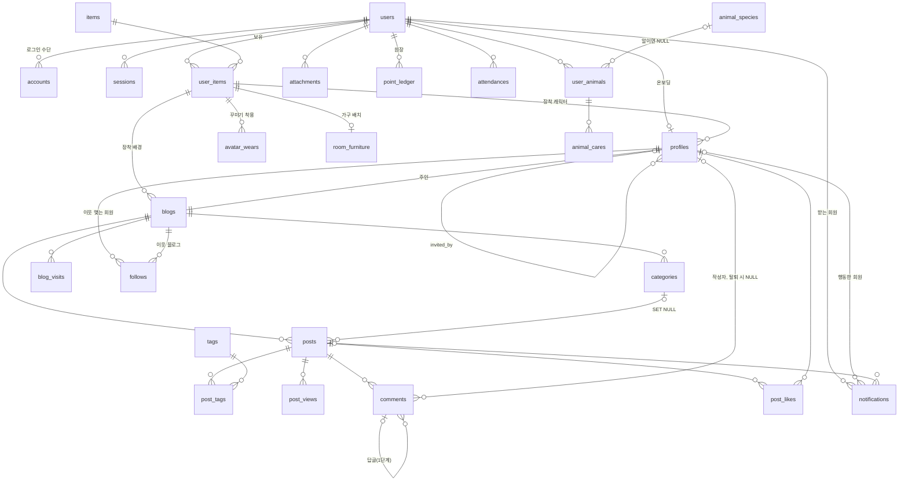

# BlogCabin 전체 ERD

`specs/001-auth-member` ~ `specs/007-town-plaza`(각 spec의 Clarifications 포함)와 `docs/01-requirements.md` v1.8을 아우르는 데이터 모델이다.

> **참고 (2026-10-08):** 이 폴더는 요구사항 v1.8 시점에 Crowfoot으로 설계한 ERD다. 실제로 구현된 최신 DB 구조는 [`../02-erd.md`](../02-erd.md)(코드 저장소의 Drizzle 마이그레이션 기준)를 본다.

- **원본(편집하는 곳)**: Crowfoot 문서 "Blogville 전체 ERD" — https://crowfoot.java21.net/workspaces/43/models/661
  - 요구사항 30건(공통 3 + 기능 27)이 테이블에 연결되어 있고, 반영 대기·근거 없는 테이블은 0건이다.
- **DDL**: [`schema.sql`](schema.sql) (Crowfoot에서 내보낸 PostgreSQL DDL, 테이블 26개·외래 키 34개). 빈 PostgreSQL 17에 그대로 실행되는 것을 확인했다.
- 대상 DBMS: PostgreSQL (기존 구현의 `23505`, `char_length`, `BOOL_OR` 사용에 맞춤). 실제 마이그레이션은 constitution III대로 Drizzle(`drizzle/`)로 만든다.

## 영역별 테이블

| 영역 | 테이블 | 근거 요구사항 |
|---|---|---|
| 회원/인증 | `users`, `accounts`, `sessions`, `verifications`, `profiles` | AUTH-01~09, GAME-09(초대) |
| 블로그 | `blogs`, `categories`, `blog_visits` | BLOG-01~07, TOWN-07(지붕 색) |
| 글 | `posts`, `tags`, `post_tags`, `post_views`, `attachments` | POST-01~09 |
| 교류 | `comments`, `post_likes`, `follows` | SOC-01~04, TOWN-08(즐겨찾는 이웃) |
| 게임 | `point_ledger`, `attendances`, `notifications` | GAME-02~09 |
| 상점/꾸미기 | `items`, `user_items`, `avatar_wears`, `room_furniture` | GAME-01, SHOP-01~06 |
| 광장(동물 농장) | `animal_species`, `user_animals`, `animal_cares` | TOWN-09 |

테이블이 없는 요구사항: POST-08 임시 글(브라우저 저장 결정), TOWN-04 인기 블로그·TOWN-11 집 성장 단계(공감 수·레벨에서 계산), TOWN-01~03·05·10(화면·광장 배치).

## 관계도

## 설계 결정 (기본값으로 정한 것)

1. **Better Auth 표준 테이블 4개**(`users`, `accounts`, `sessions`, `verifications`)를 그대로 둔다. 아이디 가입은 `accounts.provider_id = 'credential'`, 소셜은 `kakao`/`naver`/`google`. `(provider_id, account_id)` UNIQUE로 "소셜 계정 하나는 한 회원에만"(AUTH-05)을 막는다. 회원 ID는 Better Auth가 만드는 문자열이라 `VARCHAR(64)`.
2. **`users`(계정)와 `profiles`(주민)를 나눈다.** 댓글·공감·이웃·블로그는 `profiles`를 참조하므로 온보딩을 마치지 않은 회원은 DB 차원에서도 쓸 수 없다. 원장·출석·보유 아이템·첨부·농장은 `users`를 참조한다.
3. **"보유한 아이템만 장착"은 복합 외래 키**로 막는다: `profiles(user_id, character_item_id)`, `blogs(owner_id, background_item_id)`, `avatar_wears(user_id, item_id)`, `room_furniture(user_id, item_id)` → `user_items(user_id, item_id)` (NF-15, SHOP-04~06).
4. **이웃은 회원 → 블로그 방향**(`follows.follower_id → profiles`, `follows.blog_id → blogs`). 즐겨찾는 이웃은 `is_favorite` 칸이라 이웃을 끊으면 함께 풀린다(TOWN-08).
5. **원장은 `point_ledger` 하나**에 경험치·코인을 함께 기록하고 잔액 칸은 두지 않는다(NF-16). `(user_id, reason, ref_id)` UNIQUE로 "같은 사유·같은 대상은 한 번"을 DB가 막는다. `ref_id`는 FK가 아닌 문자열이며 규칙은 아래와 같다. 하루 상한은 `reward_date`(한국 날짜)로 센다.

   | reason | ref_id | reason | ref_id |
   |---|---|---|---|
   | `signup` | `signup` | `purchase` | 아이템 ID |
   | `attendance`, `attendance_streak` | `YYYY-MM-DD` | `invite` | 친구 회원 ID |
   | `post` | 글 ID | `invited` | `invited` |
   | `comment` | 댓글 ID | `farm_care` | `동물ID:돌보기:날짜` |
   | `like_received` | `글ID:공감한회원ID` | `farm_grown`, `egg_purchase` | 동물 ID |

6. **방문·조회는 사람마다 한 줄**(`blog_visits`, `post_views`): PK `(대상, 한국 날짜, 키)`, 키는 `u:{회원ID}` 또는 `b:{브라우저 식별값}`. IP는 저장하지 않고, 방문자 쪽 FK가 없어 탈퇴해도 수가 줄지 않는다. 조회수 합계는 `posts.view_count`에 누적한다.
7. **댓글 삭제**는 `deleted_at`으로 표시하고, 탈퇴 시 `author_id`는 `SET NULL`. 답글이 없는 댓글을 완전히 지우는 처리는 앱(탈퇴·삭제 트랜잭션)이 한다(SOC Clarification).
8. **초대**는 `profiles.invite_code`(6자리, CHECK로 형식 고정) + `profiles.invited_by`(자기 참조, 자기 자신 불가).
9. **농장**: 알은 `species_id IS NULL`인 `user_animals` 행. 첫 알·레벨 알은 `egg_key`(`first`, `level:5`…)와 `(user_id, egg_key)` UNIQUE로 회원당 한 번, 구매 알은 `egg_key = NULL`.
10. 모든 테이블에 `created_at`(TIMESTAMP, UTC)을 둔다. "하루" 판단이 필요한 곳은 한국 날짜 `DATE` 칸을 따로 둔다.

## DB가 아니라 앱이 지키는 규칙

DB 제약으로 표현하기 어려워 서버 코드(트랜잭션 + 잠금)에서 확인해야 하는 것들이다. plan/tasks에서 테스트로 묶어 두면 좋다.

- 글의 카테고리는 같은 블로그 것이어야 한다(`posts.category_id`).
- 자기 블로그를 이웃으로 추가할 수 없다. 즐겨찾는 이웃은 최대 10개.
- 글 하나에 태그 최대 10개. 미니룸 가구 최대 5개. 키우는 동물(알 포함) 최대 5마리.
- `avatar_wears.slot`이 그 아이템의 `items.slot`과 같아야 하고, `room_furniture`에는 `type = 'furniture'` 아이템만 놓는다.
- 블로그 주소 예약어(`RESERVED_SLUGS`), 지붕 색 이름 목록(`src/lib/art/town.ts`).
- 코인이 음수가 되지 않게 구매 전 잔액(원장 합계)을 확인한다(SHOP-03).
- `sessions.ip_address`는 Better Auth 기본 칸이다. NF-26(최소 개인정보)에 맞춰 저장하지 않도록 설정하는 것을 권한다.
